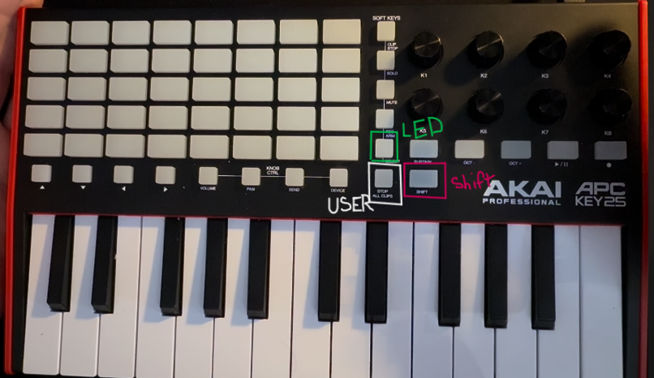
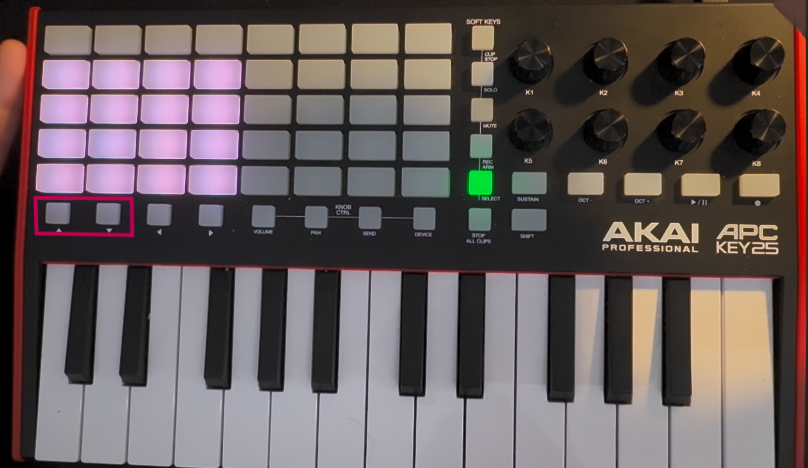

# FLStudio-APCKEY25

This script integrates the AKAI APC Key 25 with FL Studio.

## Features
- Toggle between user and LED modes with dedicated buttons.
- Customize LED colors for up to 40 pads.
- Basic knob value management for 8 knobs.

## Installation
1. Copy `device_APCKEY25.py` to:

    `C:\Users\<user>\OneDrive\Documents\Image-Line\FL Studio\Settings\Hardware\AKAI APC-KEY25`

2. In FL Studio, open MIDI settings and select the APC Key 25 script.
    
    Watch this comprehensive [video](https://www.youtube.com/watch?v=jZ-DGqriX-c) on how to enable your script in FLStudio

## Usage
### Navigating Modes
To switch between the available modes, hold the shift button and choose from the options shown in the image.

### User Mode
In User Mode, you can freely assign MIDI signals to any function within FL Studio. Note that the soft keys column will not display any LED lights in this mode.

### LED Mode
In LED Mode, you can assign any colours to the main pad. This helps with organization when assigning them to functions within FL Studio. 

#### Selecting a Color

To select and assign a color:
1. Use the up and down arrows on the left side of the keyboard to cycle through the preset colors.
2. The screen will flash with the currently selected color.
3. Press the desired pad to assign the color.

You can continue selecting different colors without changing the ones already set.

#### Selecting a Behavior
To select a behavior, follow these steps:

1. Use the left and right arrows on the left side of the keyboard to cycle through the available behaviors.
2. The screen will not display the current behavior. To identify the behavior, assign it to a random pad after each selection.
3. Press the desired pad to assign the chosen behavior.

You can continue selecting different behaviors without altering the ones already set.

#### Clear Pad
To reset the pad along with all behavior and color selections, press the LED button without holding the shift key. This action will clear all settings.

#### Exiting LED MODE 
To exit LED Mode, simply switch to User Mode. All changes will be saved, and you can continue using the keyboard as usual.

#### Experimental LED Options
- Ripple mode (Currently significant delays in the animation and midi output ) 
- Dynamic Press mode (Also created delays in midi output)

## Credits
Original implementation made by tijnzor: [FLSKEY25](https://github.com/tijnzor/FLSKEY25). 
This code served as a helpful starting point for learning how to script for FL Studio. 

## Useful References 
- [AKAI PROFESSIONAL APC KEY 25 MK2
COMMUNICATIONS PROTOCOL](https://cdn.inmusicbrands.com/akai/attachments/APC%20Key%2025%20mk2%20-%20Communication%20Protocol%20-%20v1.0.pdf)